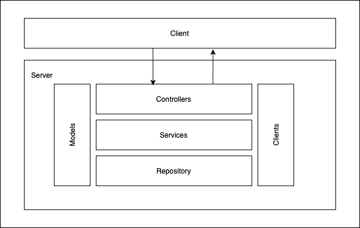

# Checkout Challenge - Payment Gateway

This .NET Web API provides functionalities for merchants to process payments through a payment gateway and retrieve details of previously made payments.

## Prerequisites

Make sure you have installed:

- [.NET 7.0 SDK](https://dotnet.microsoft.com/download)
- [Entity Framework Core Tool](https://learn.microsoft.com/en-us/ef/core/cli/dotnet#installing-the-tools)
- A suitable text editor or IDE (e.g., [Visual Studio Code](https://code.visualstudio.com/))

## Getting Started

Here are the steps to get the project up and running:

1. **Clone the repository** <br>Use the following command to clone the repository to your local machine:

```
git clone https://github.com/shanonbeary/PaymentGateway.git
```

2. **Navigate to the project directory** <br>
   After cloning, use the following command to navigate to the project directory:

```
cd PaymentGateway
```

3. **Setup Database** <br>
   If your application uses a database, make sure you have the correct connection string in the appsettings.json file for your database. Then, use the following command to apply migrations and create the database:

```
dotnet ef database update --project src/Checkout.PaymentGateway.Repository/Checkout.PaymentGateway.Repository.csproj --startup-project src/Checkout.PaymentGateway.Api/Checkout.PaymentGateway.Api.csproj
```

4. **Run the projects** <br>
   Run the the bank simulator and payement gateway in seperate terminals using the following command:

```
dotnet run --project src/Checkout.BankSimulator.Stub.Api/Checkout.BankSimulator.Stub.Api.csproj
```

```
dotnet run --project src/Checkout.PaymentGateway.Api/Checkout.PaymentGateway.Api.csproj
```

You should now be able to access the Payment Gateway endpoints at http://localhost:5233 (or https://localhost:7162 for HTTPS) to open swagger documentation.

5. **Run the tests** <br>
   This will run all test projects in the solution. <br> **_Note:_** If you want to run a specific test project, navigate to the test project directory and run the dotnet test command.

```
dotnet test
```

## Architecture

This project uses a simple Layered Architecture approach, following the Keep it Simple Stupid (KISS) principle. This architecture is ideal for small to medium-sized projects. For larger, more complex projects, I recommend considering other architectures such as Clean Architecture or Onion Architecture.



## Cloud Architecture

This project is designed to be deployed on the cloud using Amazon Web Services (AWS). I chose AWS for its robust suite of cloud services that allow us to manage, scale, and secure our application effectively. Here are key AWS technologies we could use to host the payment gateway:

- **_AWS Fargate:_** Fargate is a serverless compute engine that's ideal for hosting our application workloads. With Fargate, we can focus on application development without worrying about managing the underlying infrastructure. One of its strengths is environment consistency, as it allows us to use Docker for both local development and production. Additionally, Fargate works seamlessly with either Amazon Elastic Container Service (ECS) or Amazon Elastic Kubernetes Service (EKS).
- **_Amazon RDS:_** I'd use Amazon Relational Database Service (RDS) as the relational database system. Amazon RDS makes it easy to set up, operate, and scale a relational database in the cloud.
- **_Amazon VPC:_** Since were developing a payment gateway, network security is of important. I'd leverage Amazon Virtual Private Cloud (VPC) to secure our application. The application would only be accessible through a secure gateway.

When it comes to scalability and high availability, we'll consider deploying our application across multiple Availability Zones (AZs) to ensure continuous uptime and performance. Moreover, replication of our SQL database is an important step towards building a resilient and fault-tolerant system.

## Asumptions

- It is assumed that merchants will retain the supplied identification for subsequent utilization.
- The payment gateway is designed under the assumption that it is not required to adhere to Payment Card Industry (PCI) standards for the storage of credit card data.
- The acquiring bank would have a more comprehensive set of validation and error scenarios, for simplicity, I focused on a valid card number.

## Areas for improvement

- Using a [Asynchronous Request-Reply pattern](https://learn.microsoft.com/en-us/azure/architecture/patterns/async-request-reply) to manage asynchronous payment requests efficiently. This strategy becomes useful in scenarios where the acquiring bank may be temporarily unavailable or in cases where a payment needs to be retried. This pattern integrates smoothly with CQRS and Microservice patterns, offering a potential pathway for event sourcing implementation in the future.
- Encrypting the card number, this will help with PCI complience and aligns with standards associated with storing card numbers in our database, thereby enhancing data security.
- Build out the integration tests, .NET provided a really good framework for performant integration tests and having the bank simulator stub api we can do full integration tests. The benefit of these tests is that they serve as high-level fitness functions, validating the behavior and interactions of the system as a whole. Should the architecture evolve, these integration tests will ensure that any changes have limited and well-understood impacts on the system's overall functionality.
- Imrpove the request validation. A framework like FluentValidation could be highly beneficial in this regard, as it simplifies request validation tasks. This includes verifying details like the expiry month and year of a card before sending these requests to the acquiring bank, ensuring only valid data is processed.
